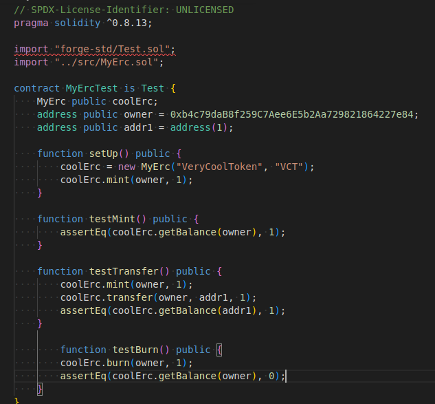

The process for creating a token using **Smart Contracts** is fairly straightforward.

In this article, you’ll learn how to create a token on the **Ethereum Blockchain **in a simple, step-by-step manner using Foundry.

## Why Foundry?

We know that the most used tools for this might be Truffle and Hardhat, but in this case we want to show you how to do this with a new tool:

> “Foundry is a portable, fast and modular toolkit for Ethereum application development."

Foundry is a new Smart Contract development tool released in 2021, and is now one of the fastest tools to test Smart Contracts.

Foundry is a tool that simplifies the process of creating, testing and deploying Smart Contracts in the Blockchain. It provides a command-line interface (CLI) that automates many of the tasks involved.

It can save you a lot of time and effort as it allows tests to be written in Solidity, and has the capability to fuzz your Smart Contract, so you can easily test edge cases. It also simplifies interaction with the Smart Contract once it is deployed, and allows it to be easily tested and debugged before deploying it to the mainnet.

Inside of Foundry, there are many tools that you can use, but for this tutorial, you will only be using `forge` and deploying our ERC20 token to Goerli

Now, follow these steps to create and deploy your own ERC20 token:

### Step 1: Installation of Foundry.

You must have a specific set of tools to create your ERC20 token.

For getting started with it, please follow the [Foundry documentation](https://book.getfoundry.sh/getting-started/installation). Once you have finished, you should be able to run `forge` and start using this tool.

### Step 2: Create a project.

Once you are done with the installation, create a new project using the following [foundry documentation](https://book.getfoundry.sh/projects/creating-a-new-project):

```
forge init my_erc
```

After this, you will see that a new folder has been created with all the files you’ll need.

### Step 3: Install Open Zeppelin SDK.

To install it, run the command `forge install openzeppelin/openzeppelin-contracts`

This dependency will be added as git submodule to your project; allowing you to import the ERC20 Open Zeppelin contract in your implementations doing the following:

```
import "@openzeppelin/contracts/token/ERC20/ERC20.sol";
```

### Step 4: Implement a basic ERC20 token.

You are going to rename the boilerplate contract: `src/Counter.sol` to `src/MyErc.sol` or any name you’d like to give it. In older versions the default contract was simply called `src/Contract.sol` and maybe in future versions this might change again, but most likely the boilerplate will sit in the src directory.

Since all the methods from the ERC20 standard come by default from the Open Zeppelin libraries, you will just expose a few of them, for testing purposes, like `mint`, `transfer` `and` `burn`. You’re going to use the `Ownable` contract, also from Open Zeppelin; so only the owner can mint and burn.

The contract would end up looking like this:


### Step 5: Implement tests for our basic ERC20 token

Update the auto-generated test file that is inside of the `test folder`. You should rename this file to `/test/MyErc.t.sol` or the name you have specified before; note that the test file is in **_Solidity_**, the reason for this is that Foundry allows you to write tests in **_Solidity_**.

Let’s go ahead and test the functions you have implemented, the file should look like this:



Before compiling your Smart Contract, you’ll need to create a `remappings.txt` file in your project root and add `openzeppelin-contracts/=lib/openzeppelin-contracts/` (learn more [here](https://book.getfoundry.sh/projects/dependencies))

In order to do this, you can run the following commands:

```
$ touch remappings.txt

$ echo "openzeppelin-contracts/=lib/openzeppelin-contracts/" >> remappings.txt
```

We might also need later mappings at least one more module, namely the forge-std package. A short version of creating the mappings of all the mappings is to write `forge remappings > remappings.txt` in the root directory. Packages are imported as git-submodules and not as npm packages. That’s also why you don’t see any @ signs that you would usually see with npm packages. Now you should be able to run `forge test` and see all tests passing!

### Step 5: Time to deploy!

Once your Smart Contract is compiled, you can deploy it to the Ethereum Blockchain. In order to do this, you will need to have some ETH in Goerli and set two environment variables:

```
export RPC_URL=<Your RPC endpoint>
export PRIVATE_KEY=<Your wallets private key>
```

Once you have everything set, you can deploy your ERC20 by running:

```
forge create MyErc –rpc-url=$RPC_URL --private-key=$PRIVATE_KEY --constructor-args MyCoolErc MCE
```

As [documentation from foundry](https://book.getfoundry.sh/forge/deploying#verifying-a-pre-existing-contract) says, to verify contracts, it’s recommended to use the `--verify` flag when deploying a contract, and for this you will need an [Etherscan API key](https://info.etherscan.com/api-keys/). Once you have it you can repeat the previous command and just add the `verify` flag & the Etherscan API key:

```
forge create MyErc –rpc-url=$RPC_URL --private-key=$PRIVATE_KEY --constructor-args MyCoolErc MCE –verify  –etherscan-api-key <your_key>
```

Check out the full tutorial by Cesar here: [https://github.com/dOrgTech/foundry-erc20-tutorial](https://github.com/dOrgTech/foundry-erc20-tutorial)

## Resources:

- [https://book.getfoundry.sh/tutorials/solmate-nft](https://book.getfoundry.sh/tutorials/solmate-nft)
- [https://book.getfoundry.sh/forge/](https://book.getfoundry.sh/forge/)
- [https://medium.com/buildbear/web3-beginner-how-to-use-foundry-to-test-an-erc20-contract-with-fuzzing-3f456e8a10f5](https://medium.com/buildbear/web3-beginner-how-to-use-foundry-to-test-an-erc20-contract-with-fuzzing-3f456e8a10f5)
